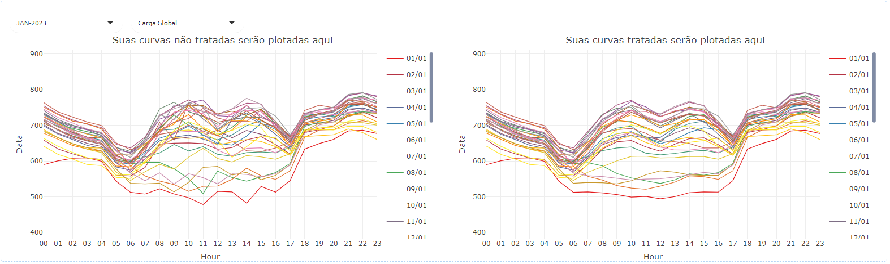

# GDfilter


Transformando curvas ruidosas de Mini e Micro Geração Distribuída Fotovoltaica (MMGD-FV) em curvas suaves.

## Índice

- [Contexto](#contexto)
- [Solução](#solução)
- [Resultados](#resultados)
- [Benefícios](#benefícios)
- [Instalação](#instalação)
- [Uso](#uso)
- [Licença](#licença)


## Contexto

Para os projetos de Mini e Micro Geração Distribuída Fotovoltaica (MMGD-FV), muitas empresas de distribuição de energia não têm acesso às medições diretas da maior parte dessas instalações. Para estimar a potência gerada em cada horário do dia, em geral, utiliza-se dados verificados de irradiação solar provenientes de estações meteorológicas, combinados com o montante de potência instalada.

No entanto, esses dados de irradiação solar muitas vezes contêm falhas devido a problemas na aquisição ou ao ruído inerente aos sistemas de sensoriamento. Isso resulta em estimativas insatisfatórias dessa geração fotovoltaica.

Se você está enfrentando esses desafios, conheça uma alternativa que **pode solucionar** esses problemas: **GDfilter**.

### Solução

O **GDfilter** transforma curvas caóticas de MMGD-FV em curvas mais suaves. Esta abordagem elimina ruídos e irregularidades, preservando a integridade das informações essenciais da curva original. Além disso, a metodologia identifica variações abruptas na curva de carga líquida de MMGD-FV, compensando-as na curva suavizada de MMGD-FV.

O diagrama de bloco abaixo ilustra a metodologia utilizada pelo GDfilter:


### Resultados

Os resultados são esclarecedores. Conforme ilustrado nas figuras abaixo, em comparação com os dados originais, o tratamento aplicado pelo **GDfilter** proporciona uma representação significativamente mais utilizável das curvas de interesse. As curvas apresentam menos irregularidades, permitindo que a curva de carga global horária adquira o formato esperado.




### Benefícios Esperados

- **Qualidade Aprimorada**: Melhora da qualidade dos dados de MMGD-FV (e, por consequência, as curvas de carga global) para que eles possam ser utilizados como variável de entrada em processos de previsão.
- **Processamento em Lote**: Capacidade de tratar grandes conjuntos de dados de uma vez, permitindo a análise de múltiplos meses ou períodos extensos sem a necessidade de processar dados individualmente. Aumenta a produtividade.

## Importante

O **GDfilter** foi desenvolvido para ajudar a melhorar a qualidade dos dados de MMGD-FV, oferecendo uma maneira mais eficiente de suavizar curvas de carga. No entanto, sabemos que as condições e características dos dados podem variar de agente para agente. Por isso, **recomendamos que cada agente teste a ferramenta** em seus próprios contextos e avalie os resultados.

**Sua experiência é essencial**: gostaríamos de receber seu feedback sobre o desempenho da ferramenta, para que possamos continuar aprimorando e ajustando o **GDfilter** às diversas realidades e necessidades.

Estamos aqui para apoiar e receber suas impressões, sugestões e eventuais ajustes necessários!


## Instalação

O **GDfilter** é um pacote desenvolvido em **R**. Para utilizá-lo, você precisará ter os seguintes programas instalados em sua máquina:

- [R 4.3.0](https://cran.r-project.org/bin/windows/base/old/4.3.0/)  
  *(Nota: O GDfilter foi desenvolvido na versão R 4.3.0 e ainda não foi testado em versões superiores.)*
  
- [RStudio](https://posit.co/download/rstudio-desktop/) *(opcional)*  
  Ambiente recomendado para visualizar, modificar e executar scripts em R.

### Passo 1: Instalar Dependências

   Após instalar o R, abra o terminal do sistema ou o console do RStudio e execute o seguinte comando para instalar os pacotes necessários:
  
    ```
    install.packages(c("openxlsx", "data.table", "tidyr", "dplyr", "lubridate", "plotly", "shiny", "shinyjs", "RColorBrewer", "zip"),
                 dependencies = TRUE)
    ```
  
   **Nota:** *Se você não possui privilégios de administrador na sua máquina, alguns desses pacotes podem não ser instalados com sucesso. Nesse caso, contate o administrador do sistema para realizar a instalação.*

### Passo 2: Baixar o Pacote GDfilter

1. **Clone o Repositório ou Baixe o ZIP**

   - **Clonar via Git:**
     ```bash
     git clone https://github.com/onsbr/gd-filter.git
     ```
     
   - **Baixar ZIP:**
     - Clique em **"Code"** e depois em **"Download ZIP"**.

2. **Extrair o Arquivo ZIP**

   Extraia o conteúdo do arquivo ZIP para um diretório de sua escolha. O pacote de interesse está no arquivo nomeado **`gdfilter_0.1.0.tar.gz`**.

3. **Instalar o Pacote no R**

   Abra o **RStudio** ou o console do R e execute o seguinte comando, substituindo `"caminho_para_o_pacote"` pelo caminho onde o arquivo **`gdfilter_0.1.0.tar.gz`** está localizado:

   ```R
   install.packages("caminho_para_o_pacote/gdfilter_0.1.0.tar.gz", repos = NULL, type = "source")
   ```

### Uso

Após a instalação do **GDfilter**, você pode começar a utilizá-lo executando os exemplos fornecidos. Siga os passos abaixo:

1. **Carregar o Pacote**

   Abra o **RStudio** ou o console do R e carregue o pacote:

   ```R
   library(gdfilter)
   ```

2. **Executar o GDfilter**

   Execute a função principal do pacote:
    
   ```R
   run_gdfilter()
   ```
   Isso abrirá uma interface no seu navegador para utilização do GDfilter similar a imagem abaixo. Você poderá carregar seus dados, visualizar e baixar os resultados.
 
   

3. **Fazer o Upload do Arquivo de Dados**

   Você deve utilizar o mesmo template que é usado para gravar dados no sistema **SAGIC** (contendo as parcelas de geração e intercâmbio).
  
   #### Detalhes:
   - O arquivo de entrada deve conter dados horários formatados conforme o padrão do SAGIC.
   - **Diferencial**: Em vez de separar os meses em arquivos diferentes, você pode concatenar todos os meses em um único arquivo de entrada.
  
   Quando você fizer download dos resultados, o **GDfilter** gera um **arquivo `.zip`** contendo os resultados:
   - Cada mês processado será exportado em um arquivo **`.xlsx`** separado, um para cada mês.
   - Isso facilita a importação dos dados no sistema SAGIC, que só aceita gravações mensais.
  
   > Exemplo: Se você enviar dados de 3 meses concatenados, o **GDfilter** criará um `.zip` com 3 arquivos `.xlsx`, um para cada mês, prontos para serem carregados no SAGIC.
 
## Licença

Este projeto está licenciado sob a Licença MIT. Veja o arquivo [LICENSE](LICENSE) para mais detalhes.

Repositório do projeto: [https://github.com/onsbr/gd-filter](https://github.com/onsbr/gd-filter)


---
